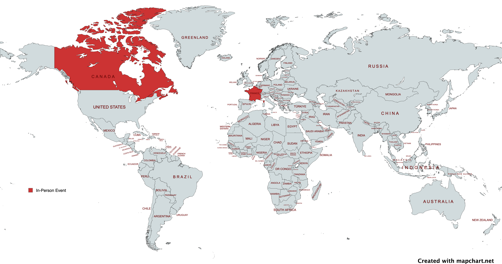

# Talks - Teiva Harsanyi

## 2024

### 4 Reliability Anti-Patterns ([ConFoo 2024](https://confoo.ca/en/2024/) conference)

Tags: _#reliability #sre_

Slides:
  * [Online](https://docs.google.com/presentation/d/e/2PACX-1vSliUbEggyAxG6lXczPtR_lGRR5UIURiEJ3mlyf9Hlw-BNcfxloTWIPcwjmxeAgGxbnIAyodtpuLkEc/pub?start=false&loop=false&slide=id.g2b9775219ee_0_57)
  * [PDF](res/confoo-2024-4-reliability-anti-patterns.pdf)

⭐ Selected as [top 1](https://confoo.ca/en/2024/top) talk of the conference

### I Completed All 9 Advents of Code: Lessons Learned ([ConFoo 2024](https://confoo.ca/en/2024/) conference)

Tags: _#coding_

Slides:
  * [Online](https://docs.google.com/presentation/d/e/2PACX-1vS4opZu2emQk76w2u1PD9YZxOpbCY8I-qWbKY6USTCrlHAGlvfirktuINnJKtCwMR3QBpt4-ayLXqQ2/pub?start=false&loop=false&resourcekey=0-hBAWmWmBsUFwXVJAk-0KNQ&slide=id.g2b14d668740_2_28)
  * [PDF](res/confoo-2024-I-completed-all-9-advents-of-code.pdf)

### 4 Common Go Mistakes ([Golang Insiders](https://twitter.com/i/communities/1685641800449462272) meetup)

Tags: _#golang_

Slides:
  * [Online](https://docs.google.com/presentation/d/e/2PACX-1vR9faiR0Maxpfj383l564ib3ch94N8z23MZxqCH-t7AuEiPhkGYWmRXIuHxmRzq1msQGmqjVvz-GLUo/pub?start=false&loop=false)

## 2023

###  Google, Tech, and Go with Teiva Harsanyi (Ardan Labs podcast with Bill Kennedy)

Tags: _#golang #career_

* [YouTube](https://www.youtube.com/watch?v=RdQMjTgAfDs)

### 3 Reliability Anti-Patterns ([SRE France](https://www.meetup.com/fr-FR/site-reliability-engineering-france/events/296967843/) meetup)

Tags: _#reliability #sre_

Slides:
  * [Online](https://docs.google.com/presentation/d/e/2PACX-1vS3r68xeyeqmWys1I5NuQKJPCwNV-qqtpgOT8OJY0GQdg-UeuQLGvgE0-6c4m64A9lfhXK2kX12xH7e/pub?start=false&loop=false)
* [YouTube](https://youtu.be/mpOGwttM_v4?si=G8eiy-s6PEthZInm&t=1550) (French)

### Running a Go App in Kubernetes: CPU Impacts ([P99 Conf](https://www.p99conf.io/) online conference)

Tags: _#golang #kubernetes #performance_

* Slides:
  * [Online](https://docs.google.com/presentation/d/e/2PACX-1vRabs0KJAXj80z3WzDP40ZAfXBNPKpUiDE2_jgl0jqvXcvw9FcphBj5tlOwRzQUIDE4qMQx6NP37W76/pub?start=false&loop=false#slide=id.p)
* [Video](https://www.p99conf.io/session/running-a-go-app-in-kubernetes-cpu-impacts/) (registration required)

### 3 Erreurs Courantes en Go ([Golang Paris](https://www.meetup.com/fr-FR/golang-paris/) meetup)

Tags: _#golang_

* Slides:
  * [Keynote](res/golang-paris-2023-3-erreurs-courantes-en-go.key)
  * [PDF (with animations)](res/golang-paris-2023-3-erreurs-courantes-en-go-animations.pdf)
  * [PDF (flat)](res/golang-paris-2023-3-erreurs-courantes-en-go-flat.pdf)
* [YouTube](https://www.youtube.com/watch?v=kRohPrlH8Tw) (French)

## 2022

### Reliability? (Consulting)

Tags: _#reliability #sre #slo #chaosengineering_

* Slides:
  * [Keynote](res/consulting-2022-reliability.key)
  * [PDF](res/consulting-2022-reliability.pdf)
  * [SlideShare](https://www.slideshare.net/TeivaHarsanyi/reliability-251744387)

## 2021

###  How to Make Mistakes in Go ([Go Time](https://changelog.com/gotime) podcast - Episode #190)

Tags: _#golang #book #podcast_

* [Episode](https://changelog.com/gotime/190)
* [Spotify](https://open.spotify.com/episode/0K1DImrxHCy6E7zVY4AxMZ?si=akroInsPQ1mM5B5V2tHLUw&dl_branch=1)

## 2020

### Mechanical Sympathy in Go ([GopherCon Turkey 2020](https://gophercon.ist/) online conference)

Tags: _#golang #cpu #memory #performance_

* Slides:
  * [Keynote](res/gophercon-turkey-2020-mechanical-sympathy.key)
  * [PDF (with animations)](res/gophercon-turkey-2020-mechanical-sympathy-animations.pdf)
  * [PDF (flat)](res/gophercon-turkey-2020-mechanical-sympathy-flat.pdf)
* [YouTube](https://www.youtube.com/watch?v=cetmDfqr2BU)
